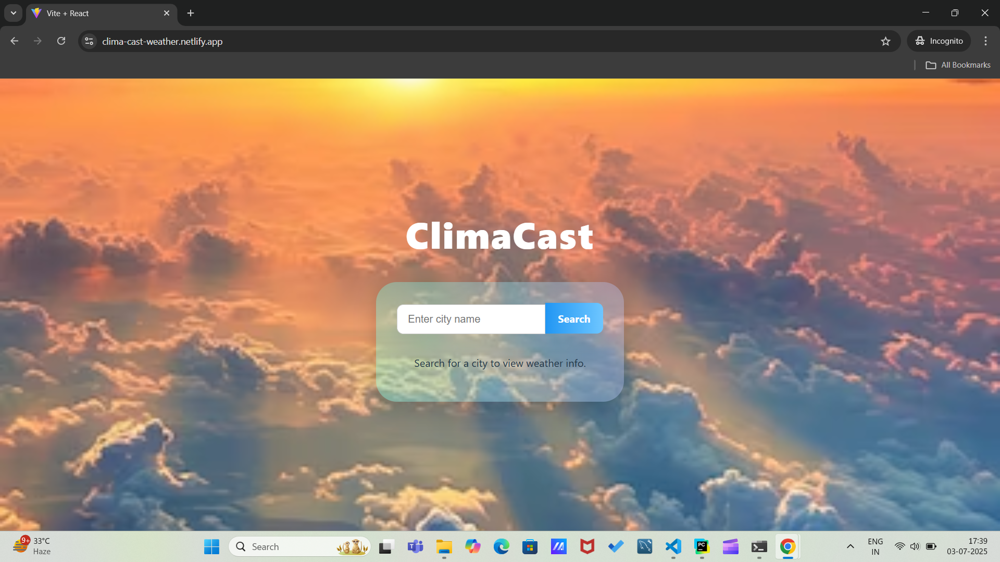
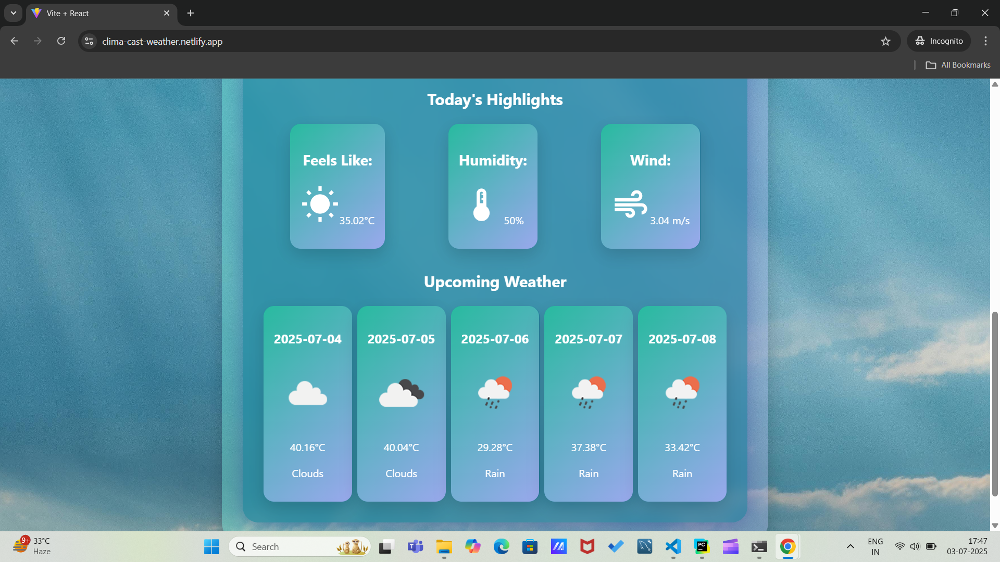
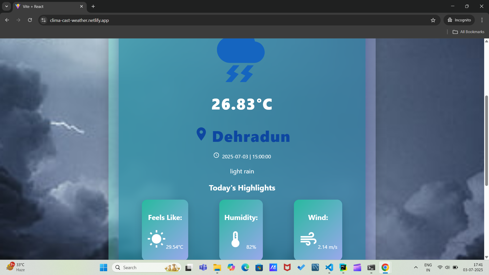
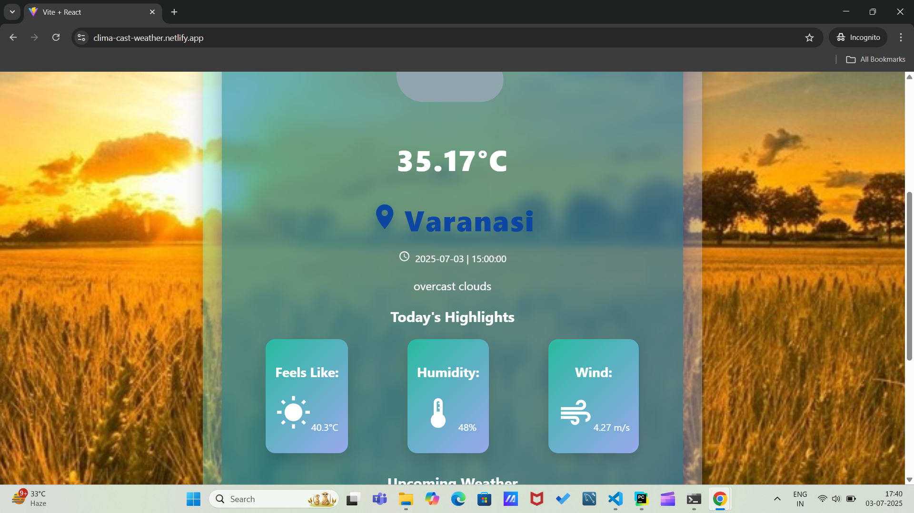

# ClimaCast - Weather Forecast App
ClimaCast is fast , minimal, and responsive weather application build using React.js + Vite and powered by OpenWeatherMap API
## 🚀 Features
- 🔍 Search real-time weather by city name
- 🌡️ Display temperature,humidity,wind speed
- 📱Clean and responsive UI

##  🛠️ Tech Stack 

React.js
Vite
OpenWeatherMap API
Material UI

## Demo

### 🔍 Search View


### 🌤️ Weather Card Display


### ⚡Background Demo



## Installation & Setup
Clone the repository:
```bash
git clone https://github.com/shivangi-6382/clima-cast-weather.git
cd clima-cast-weather
```
Install dependencies
```bash
npm install
```
API key Setup- create a file name .env in root folder and add your OpenWeather API key
like
```.env
VITE_WEATHER_API_KEY=your_openweather_api_key
```

Running the App
```bash
npm run dev
```

## 🌐Live Demo
https://clima-cast-weather.onrender.app

## 💡 What I Learned
Integrating REST APIs in React

Handling async data and loading states

Using Vite for fast development

Managing state with Hooks

Designing clean, responsive layouts

## 📄 License

This project is licensed under the **MIT License**.  
Feel free to use, modify, and distribute it with attribution.

See the [LICENSE](./LICENSE) file for more details.


